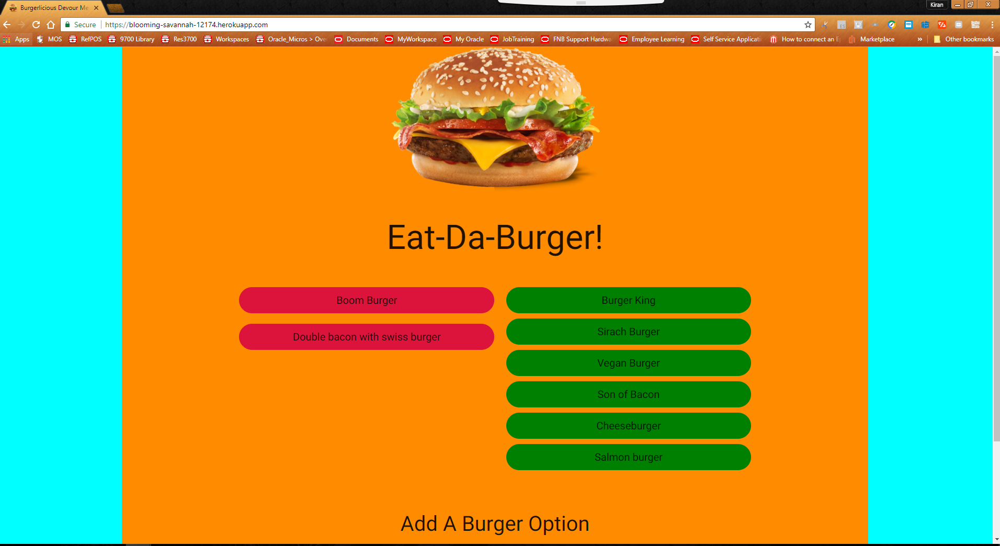

# Eat-Da-Burger (Using Sequelize)

A burger logger created with sequelize(Sequelize is a promise-based Node.js ORM for Postgres, MySQL, SQLite and Microsoft SQL Server. It features solid transaction support, relations, read replication and more.)
Additionally used Node, Express, Handlebars. Followed the MVC design pattern; used Node and MySQL to query and route data in the app, and Handlebars to generate the HTML.

* Eat-Da-Burger! is a restaurant app that lets users input the names of burgers they'd like to eat.

* Whenever a user submits a burger's name, the app will display the burger on the left side of the page -- waiting to be devoured.

* Each burger in the waiting area also has a `Devour it!` button. When the user clicks it, the burger will move to the right side of the page.

* Your app will store every burger in a MySQL database, whether devoured or not.

[Please click here to visit the site deployed on Heroku.](https://fathomless-harbor-36556.herokuapp.com/)

***

